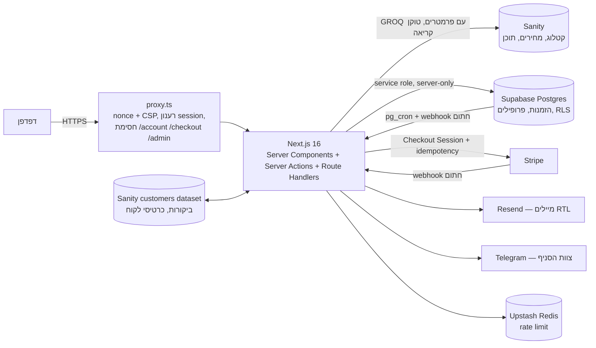

# SpaceHub — ארכיטקטורה ומפת אבטחה

## רכיבים

| שכבה | קבצים מרכזיים |
|---|---|
| Proxy (Next 16 — מחליף middleware) | `src/proxy.ts`, `src/lib/security/csp.ts`, `src/lib/supabase/proxy-session.ts` |
| כותרות אבטחה | `next.config.ts` |
| אימות | `src/app/actions/auth.ts`, `src/lib/server/auth.ts`, `src/lib/supabase/cookie-options.ts` |
| תמחור (מקור אמת) | `src/lib/server/pricing-source.ts`, `src/lib/server/quote.ts`, `src/lib/domain/pricing.ts` |
| הזמנה ותשלום | `src/app/actions/checkout.ts`, `src/app/api/stripe/webhook/route.ts`, `src/lib/server/booking-lifecycle.ts`, `src/lib/server/refunds.ts` |
| מסד נתונים | `supabase/migrations/0001…0005` |
| קטלוג | `src/lib/content/catalog.ts`, `src/sanity/lib/queries.ts` |
| סודות | `src/lib/env.server.ts` (Zod, `server-only`) |

## מסלול הזמנה (מקצה לקצה)

1. **עמוד חלל** — `BookingWidget` מציג מחיר משוער מהקטלוג (תצוגה בלבד).
2. **סל** — `src/stores/cart.ts` שומר ב-localStorage רק `spaceId`, תאריך, דקות, מושבים, `addonIds`. אין מחיר.
3. **`/checkout`** — דורש התחברות (proxy + `requireUser`). `buildQuote` מחשב מחדש מול Sanity (טוקן קריאה, בלי CDN).
4. **`createCheckout` (Server Action)** — Zod → rate limit (משתמש + IP) → Turnstile → חישוב מחדש → `insert` להזמנה `pending_payment` (אילוץ `exclude using gist` מונע חפיפה) → Stripe Checkout Session עם idempotency key.
5. **Stripe webhook** — `constructEvent` (חתימה + חותמת זמן) → בדיקת `stripe_events` (dedupe) → הפעלת ההזמנה → מייל אישור (idempotency key) + Telegram.
6. **Cron** (`pg_cron` → `/api/cron/maintenance`, `timingSafeEqual`) — פג תוקף להזמנות לא משולמות, תזכורות, ניקוי.

## מפת אבטחה — מה מגן על מה

| נכס | איום | הגנה | איפה |
|---|---|---|---|
| מחיר | שינוי בצד לקוח | חישוב בשרת מול Sanity בכל quote ו-checkout | `quote.ts`, `checkout.ts` |
| הזמנה של לקוח אחר | IDOR | סינון `user_id` בשרת + RLS + קוד אקראי 8 תווים | `account-bookings.ts`, `loadOwnBookingByCode`, `0001_init.sql` |
| חדר | הזמנה כפולה | `exclude using gist (space_id with =, during with &&)` | `0001_init.sql` |
| חשבון | brute force / ATO | OTP בלבד, rate limit IP+מייל+תקציב יומי, Turnstile, התראת מכשיר חדש, step-up | `auth.ts`, `devices.ts`, `step-up.ts` |
| Session | גניבת עוגייה | `HttpOnly`, `Secure`, `SameSite=Lax`, תוקף מתחדש | `cookie-options.ts` |
| דפדפן | XSS | CSP nonce + `strict-dynamic`, אין `unsafe-eval`, תוכן משתמש כטקסט, JSON-LD מוסנן | `csp.ts`, `structured-data.ts` |
| Webhooks | זיוף / replay | חתימות + חלון 300 שניות + טבלאות dedupe | שלושת ה-routes |
| סודות | דליפה | `server-only`, Zod, אין `NEXT_PUBLIC` על סוד, gitleaks ב-CI | `env.server.ts`, `.github/workflows/ci.yml` |
| מטמון | דליפת דף אישי | `private, no-store` על דפים פרטיים ו-`/api/*` | `proxy.ts`, `next.config.ts` |
| ביקורות | ספאם / תוכן זדוני | התחברות + הזמנה מאומתת + Turnstile + honeypot + rate limit + תור אישור + re-encode לתמונות | `api/reviews`, `review-images.ts` |
| ייצוא | Formula injection | `'` לפני `= + - @`, LRM, BOM | `lib/export/csv.ts` |
| פרטיות | מעקב בלי הסכמה | GA4 נטען רק אחרי "מאשר/ת" | `ConsentAnalytics.tsx` |

## החלטות מתועדות

- **אין Service Worker** — אין סיכון לשמירת דפים אישיים במטמון.
- **התחברות לפני תשלום** — אין תשלום אורח, ולכן אין guest token.
- **`style-src 'unsafe-inline'`** נשאר — Framer Motion ו-`style` של React; סקריפטים נעולים ב-nonce.
- **שמות עוגיות `__Host-`** — לא אפשרי עם `@supabase/ssr`; הדגלים עצמם מוקשחים.
