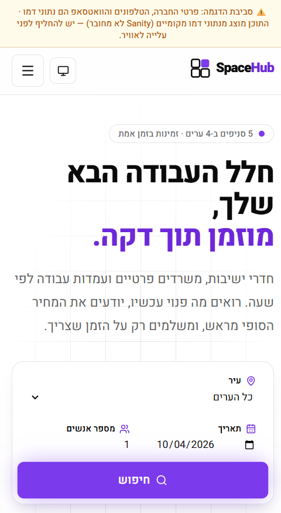
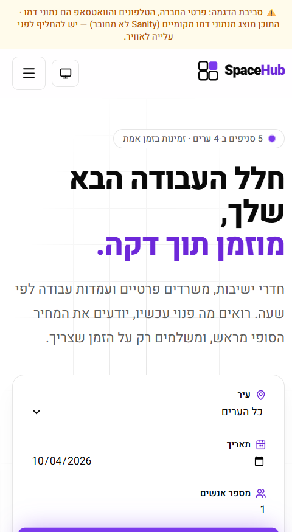
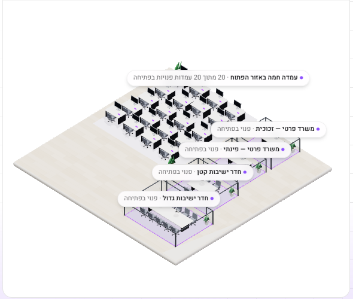
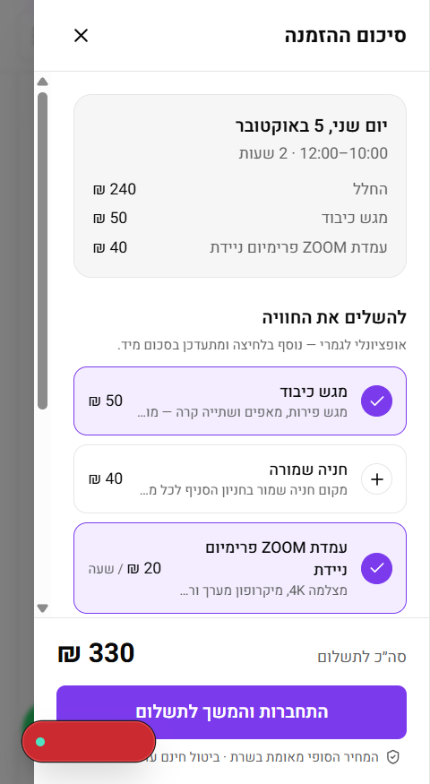
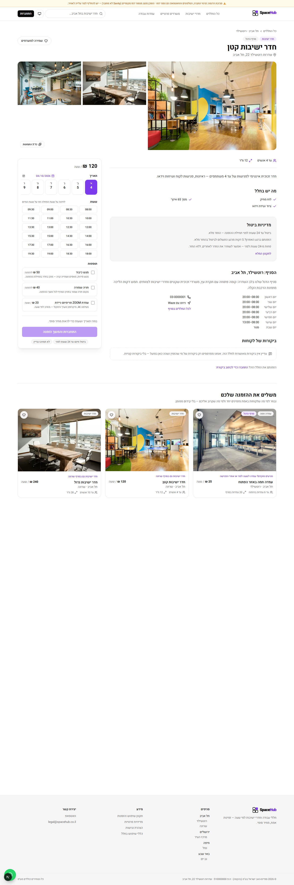
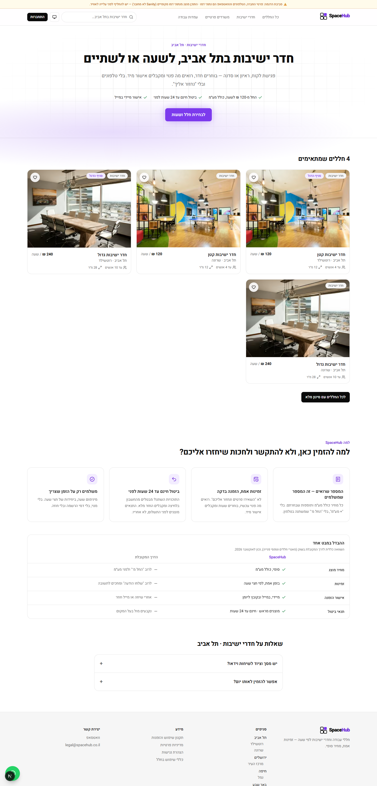
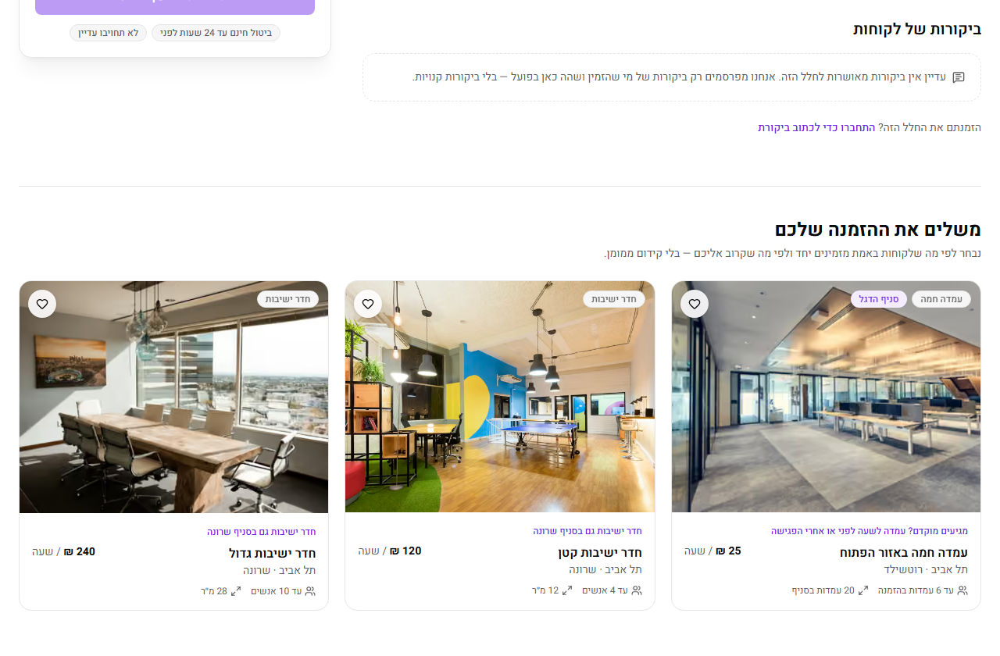
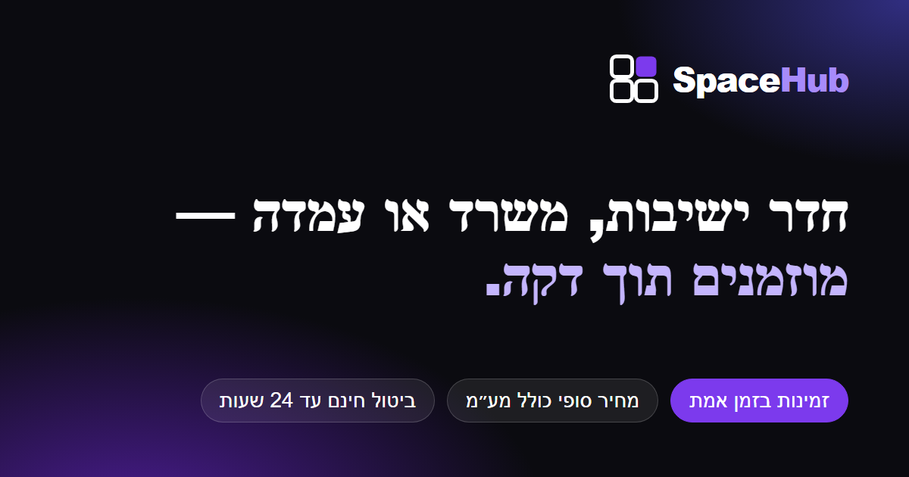

# בוקר טוב אבישי — דוח לילה של SpaceHub

## בשורה התחתונה

- **כל הסקריפטים (2 עד 5) בוצעו במלואם.**
- הקוד עובר build, ‏lint, ‏type-check ו-51/51 בדיקות.
- בביקורת הסופית (סקריפט 5): **117 מתוך 150 סעיפים ✅**, ‏26 ⚠️, ‏6 ❌, ו-1 לא רלוונטי.
- **ההחלטה: No-Go זמני.** זו לא בעיה בקוד. שלוש בדיקות קריטיות (ניסיון שינוי מחיר, IDOR עם שני משתמשים, ורכישה מלאה) פשוט אי אפשר להריץ בלי המפתחות שלך. ברגע שהם יחוברו, מדובר בכשעה של בדיקות אצלי.

הדוח המלא, סעיף אחר סעיף עם ראיות: [`docs/script5/final-audit.md`](../script5/final-audit.md)

---

## מה נבנה הלילה

### סקריפט 2 — המרות, ביצועים, תחרות
- **חיפוש חכם:** סולח על שגיאות כתיב ("התכוונת ל…"), עם תמונה ומחיר בדרופדאון.
- **מגירת סיכום לפני תשלום:** תוספות בלחיצה אחת, וגם "פנוי גם בשעות האלה".
- **ביקורות:** רק מלקוחות עם הזמנה ששולמה. תור אישור, תמונה נקייה מ-EXIF, ‏honeypot ו-Turnstile.
- **מפת קומה בתלת־ממד:** ריאליסטית, עם Draco ו-fallback, ובלי מסך לבן.
- **נגישות:** ‏axe 0 הפרות, ‏Lighthouse נגישות 100.
- **מתחרים, מסרים, A/B:** דוח חיכוך UX, מחקר מתחרים עם מקורות, טבלת "למה אנחנו", ‏4 עמודי נחיתה, ‏FAQ ותוכנית A/B.

### סקריפט 3 — חומת אבטחה והשקה
- **כותרות אבטחה:** כל הכותרות פעילות (CSP עם nonce, ‏HSTS, ‏COOP, ‏CORP ועוד), ונוסף דיווח הפרות CSP.
- **endpoints חדשים:** ‏`/api/health`, ‏`/.well-known/security.txt`, וייצוא הזמנות ל-CSV (מוגן מ-Formula Injection, נפתח נכון באקסל ובעברית).
- **SEO ושיתוף:** ‏JSON-LD לכל חלל וסניף, ‏sitemap עם עמודי הנחיתה, תמונת שיתוף ממותגת, אייקונים ו-manifest.
- **GA4 בכפוף להסכמה:** באנר עם כפתורים שווי משקל, ואירועי `view_item`, ‏`add_to_cart`, ‏`begin_checkout`, ‏`purchase`.
- **תלויות:** ‏Dependabot, ‏CI (בדיקות, ‏audit, ‏gitleaks), ו-overrides לתלויות פגיעות.

### סקריפט 4 — חבילת מסירה ללקוח
- ב-`docs/script4/`: מכתב Welcome, תסריט Loom, ערכת פוסטים להשקה, הצעת ריטיינר, ודף "מה עושים אם נפרצנו".

### סקריפט 5 — ביקורת סופית
- כל 150 הסעיפים נבדקו, כל אחד עם ראיה.
- תוקן תוך כדי:
  - מסמך ארכיטקטורה חדש (`docs/ARCHITECTURE.md`).
  - README בעברית.
  - אירוע `add_to_cart` שהיה חסר.
  - הוסרה תלות מתה (`framer-motion`).

---

## צילומי מסך

| | |
|---|---|
|  |  |
| **אחרי** התיקונים | **לפני** |
|  |  |
| מפת קומה תלת־ממדית | מגירת סיכום לפני תשלום |
|  |  |
| עמוד חלל | עמוד נחיתה (חדר ישיבות) |
|  |  |
| ביקורות והמלצות | תמונת השיתוף (OG) |

---

## הנחות שהנחתי במקומך (ביקשת לא לשאול)

כולן מתועדות, ואפשר לשנות כל אחת:

1. **אין Guest Checkout.** הזמנה מחייבת התחברות, כדי לאפשר ביטול, נקודות וסימון הגעה.
2. **התחברות ב-OTP במייל + Google, בלי SMS.** SMS דורש ספק ותקציב, וזו החלטה שלך.
3. **אנימציות גלילה ב-CSS טהור במקום Framer Motion.** אפס JavaScript, ולכן טוב יותר לביצועים.
4. **אין Meta Pixel ואין Abandoned Cart.** הראשון דורש מזהה, השני הסכמה שיווקית.
5. **שאלות הראיון של סקריפט 4** נענו על ידי בהנחות סבירות (`docs/script4/00-interview-answers.md`).
6. **לא הומצאו** ביקורות, מספרים, נתוני מתחרים, קופונים, סכומים או מפתחות. כל מקום כזה מסומן "ממתין לך".

---

## ממתין לך (לפי סדר חשיבות)

**כדי להפוך את ה-No-Go ל-Go:**
1. **מפתחות:**
   - Supabase (והרצת migrations עד 0005)
   - Sanity (tokens + webhooks)
   - Stripe (מצב test)
   - Resend
   - Upstash
   - Turnstile
2. **שני סודות חדשים:**
   - `NEXT_SERVER_ACTIONS_ENCRYPTION_KEY`: ליצור עם `openssl rand -base64 32`.
   - `CSV_EXPORT_TOKEN`: 40 תווים לפחות.
3. **Staging ב-Vercel** עם Deployment Protection, ומפתחות נפרדים ל-Preview ול-Production.
4. **להגיד לי שזה מוכן.** אז אריץ את בדיקת ה-IDOR, את ניסיון שינוי המחיר ואת הרכישה המלאה, ואעדכן את הביקורת.

**חשבונות ואבטחה:**
- ‏2FA בכל החשבונות.
- ‏Branch Protection ב-GitHub.
- ‏CORS ו-MFA ב-Sanity.
- תוקף OTP של 300 שניות בדשבורד של Supabase.
- ‏WAF ב-Vercel.
- גיבוי / PITR.
- דומיין ו-DNS (‏SPF, ‏DKIM, ‏DMARC, ‏CAA). הרשומות מוכנות ב-`docs/script3/B-launch.md`.

**תוכן ועסק:**
- מחירים ותמונות אמיתיים, ופרטי חברה אמיתיים.
- מייל אבטחה (ל-security.txt).
- נוסח משפטי סופי אצל עו"ד (כולל תיקון 13).
- סכום ריטיינר, קופון השקה וזמני SLA.
- מזהה GA4, ‏Meta Pixel, ספק SMS, ‏WhatsApp Business API, וטלפון חירום.
- מדיניות moderation לביקורות.

---

## איך להריץ

```bash
cd spacehub
npm ci
npm run dev        # פיתוח
npm run build && npx next start -p 3100   # פרודקשן מקומי
npm test           # 51 בדיקות
```

בלי מפתחות, האתר רץ על נתוני הדוגמה, ותשלום, מיילים והתחברות מושבתים בצורה מסודרת (עם הודעות, לא עם קריסה).
